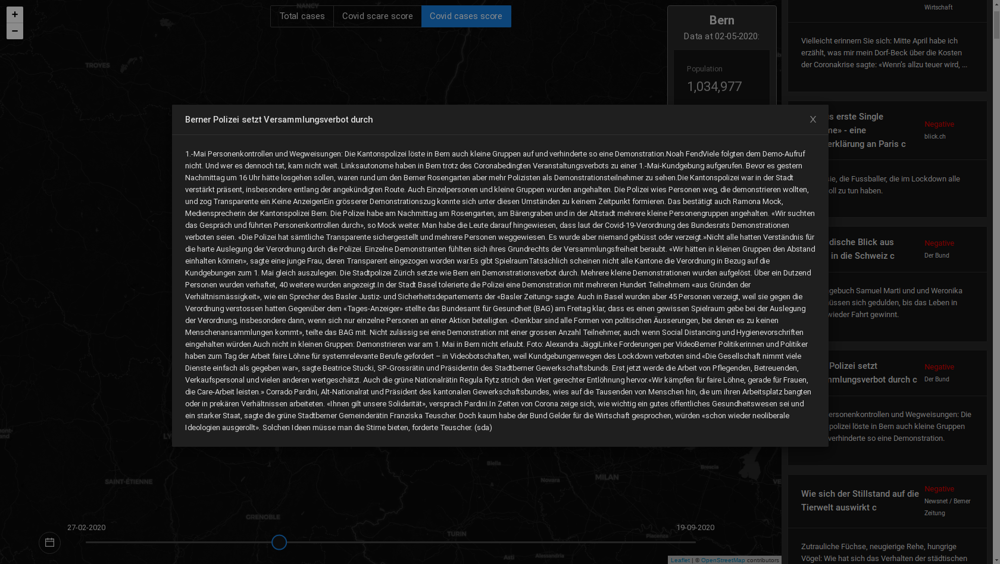
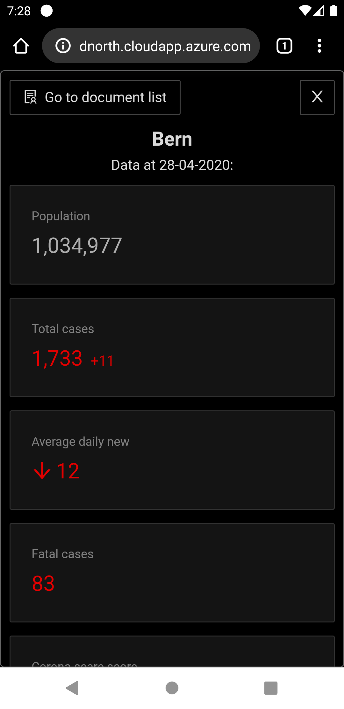

## Corona scare map application
It was our submission for HackZurich2020: https://devpost.com/software/corona-scare-map-app
Because of licensing we cannot share data that we used, but here you can find the code that we used for processing data and making frontend part.

## Gallery

#### There is also mobile version available:

