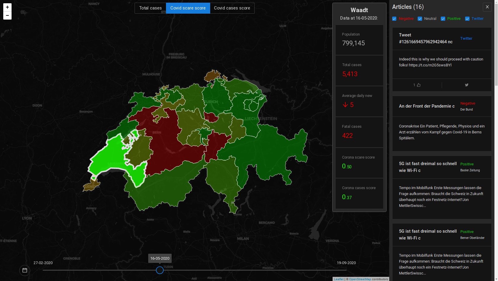
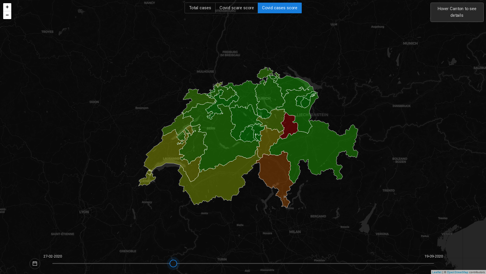
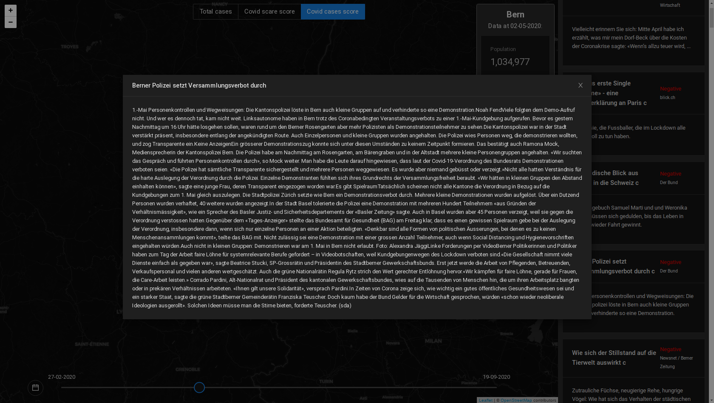
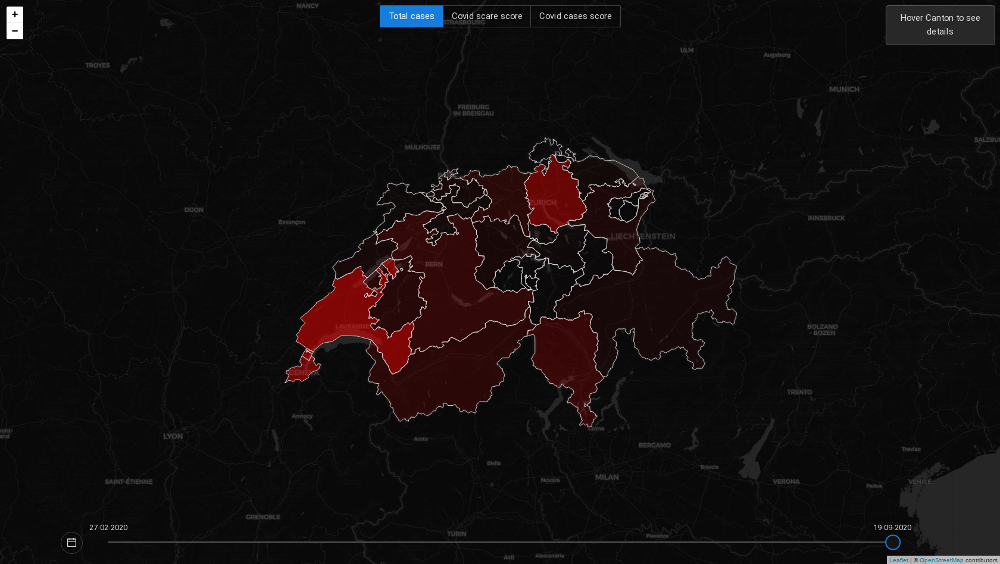
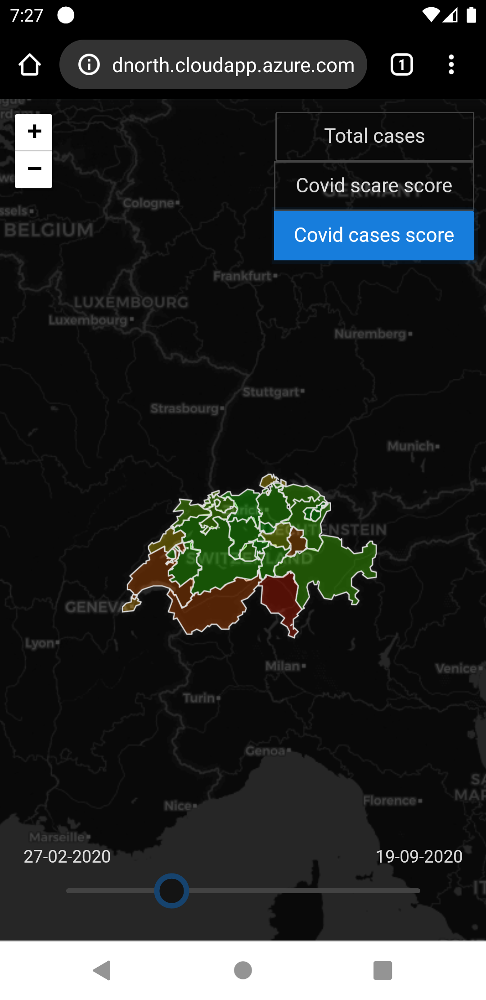
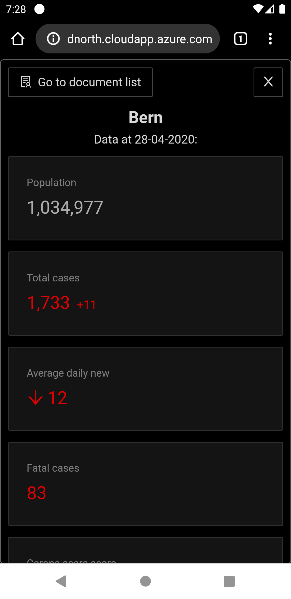

## Corona scare map application

This application shows "Coronavirus scare score" in Switzerland divided by cantons, based on sentiment of news that refers to Coronavirus and specified canton.
For dates before middle of June there are also available tweets regarding Covid topic. In application you can select various dates to view data
(note that for more recent dates there might be missing data). You can also quickly view articles and tweets that makes up the final score.
Besides "Corona scare score" you can also view "Corona cases score", which is calculated based on population, changes and trends of new cases of covid.
That indicator shows in which places virus is more active recently (or where it was active in the past).

### Timeline
On the bottom of the screen there is timeline, which allows to see past data. There is also calendar button, which allows easy selection of specific date.

### Map modes
- Total cases
- Corona scare score
- Corona cases score

### Article list
You can filter article list by type and sentiment, for Twitter posts you can see likes count and button to original post.
For other articles you can see full text by clicking on article preview.

## Gallery

#### There is also mobile version available:

***
***
***

This project was bootstrapped with [Create React App](https://github.com/facebook/create-react-app).

## Available Scripts

In the project directory, you can run:

### `yarn start`

Runs the app in the development mode. 
Open [http://localhost:3000](http://localhost:3000) to view it in the browser.

The page will reload if you make edits. 
You will also see any lint errors in the console.

### `yarn test`

Launches the test runner in the interactive watch mode. 
See the section about [running tests](https://facebook.github.io/create-react-app/docs/running-tests) for more information.

### `yarn build`

Builds the app for production to the `build` folder. 
It correctly bundles React in production mode and optimizes the build for the best performance.

The build is minified and the filenames include the hashes. 
Your app is ready to be deployed!

See the section about [deployment](https://facebook.github.io/create-react-app/docs/deployment) for more information.

### `yarn eject`

**Note: this is a one-way operation. Once you `eject`, you can’t go back!**

If you aren’t satisfied with the build tool and configuration choices, you can `eject` at any time. This command will remove the single build dependency from your project.

Instead, it will copy all the configuration files and the transitive dependencies (webpack, Babel, ESLint, etc) right into your project so you have full control over them. All of the commands except `eject` will still work, but they will point to the copied scripts so you can tweak them. At this point you’re on your own.

You don’t have to ever use `eject`. The curated feature set is suitable for small and middle deployments, and you shouldn’t feel obligated to use this feature. However we understand that this tool wouldn’t be useful if you couldn’t customize it when you are ready for it.

## Learn More

You can learn more in the [Create React App documentation](https://facebook.github.io/create-react-app/docs/getting-started).

To learn React, check out the [React documentation](https://reactjs.org/).
